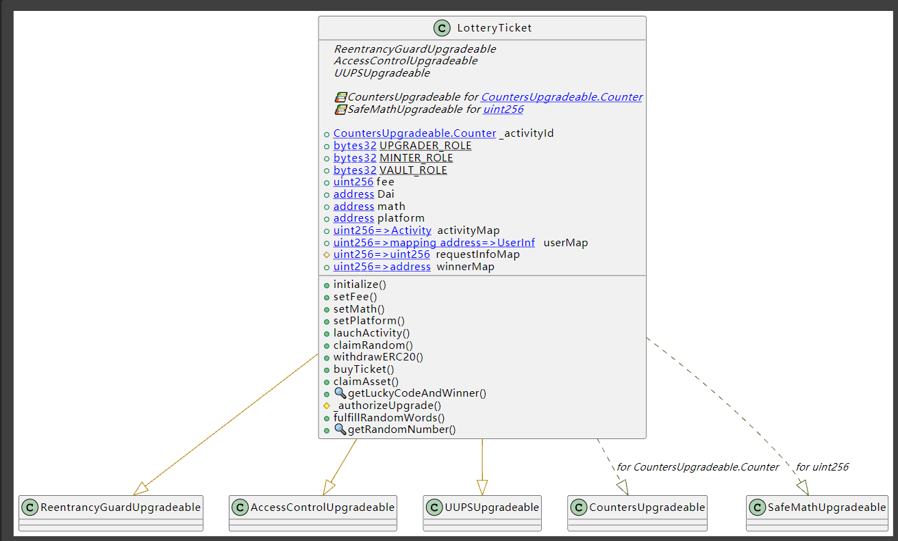
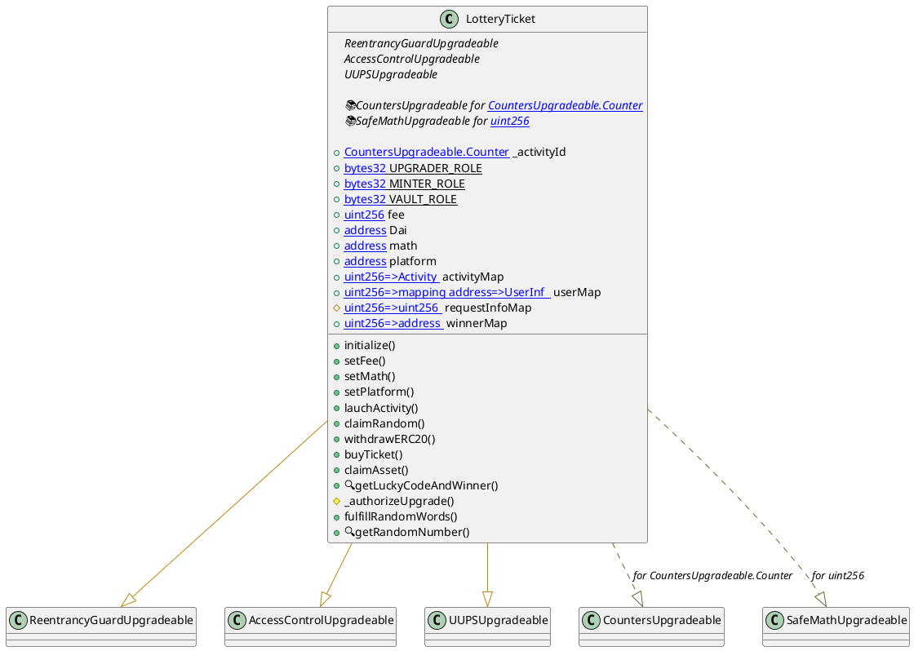

# Lottery Ticket Developer Document

> The Project is Lotter Ticket contract. If you use this contract ,must be careful.

## Run Project

- `git clone ''`

- `npm install`

- `npm install --save-dev hardhat`

- `npx hardhat clean`

- `npx hardhat compile`

- `npx hardhat node // run localhost blockchain for run test js.`

- `npx hardhat test .\test\lotteryTicket-test.js --network localhost`

### Deploy (rinkeby)

` npx hardhat run .\scripts\testnet\deploy.rinkeby.js --network rinkeby`

## Interact with Contract

` npx hardhat run .\scripts\testnet\interaction.rinkeby.js --network rinkeby `

## Detail

| Name               | Description                                                 | Address                                    | network |                  |
| ------------------ | ----------------------------------------------------------- | ------------------------------------------ | ------- | ---------------- |
| LotteryTicket.sol  | main contract                                               | 0x115A23e775A3D6ac61368e16baA7033bFF7721Bf | rinkeby | Goerli  verified |
| DaiToken.sol       | mock  ERC20 token                                           | 0x7fC673ecE3b71b72A88AFAB070FEdB81da6eaa1c | rinkeby |                  |
| Math.sol           | A tool contract with chainklink oracle for random function. |                                            |         |                  |
| ILotteryTicket.sol |                                                             |                                            |         |                  |
| IMath.sol          |                                                             |                                            |         |                  |

## Interface and plantuml

## Other-TODO

### 随机数安全问题

> 当前使用的随机数，是利用区块链上的相关数据生成的，在传统的随机数生成过程中，这种操作是危险的！

但是在当前的应用环境中，确实可行的。因为这个中奖数字的产生，实在这个活动结束之后才公布的，也就是说用户在活动发起到结束之间买定的数字是定的，不能够再次进行修改。

### 使用Oracle (chainlink)

使用这种方式能够真随机，但是在成本上确实一个需要考虑的因素。

## 用户的购买问题

> 当前的设置中，用户只是针对一个数字进行加注，没有考虑到用户可能会同时买多个数字。

也就是一对多问题。

由于时间问题，未能加上这块逻辑

### 解决方法

加上mapping(useraddre=> activityId=> luckyCode=> amount) 就可以了。

## 题目中时间问题

> 题目中的同一时间仅支持一个彩票活动存在：未能确定是时间点，还是持续时间。
> 
> 在代码中写的是持续时间

## <mark>NOTICE</mark>

> 为了方便测试，代码中随机数是写死，line(130), 注释掉，改成line(128)即可。

## Audit

> 代码审计中，只是简单进行了逻辑测试。

## 可玩性

在设计中为了实现可玩性，可以将每一次的彩票看成是erc721, 将用户的购买操作看成erc1155, must be interesting.
